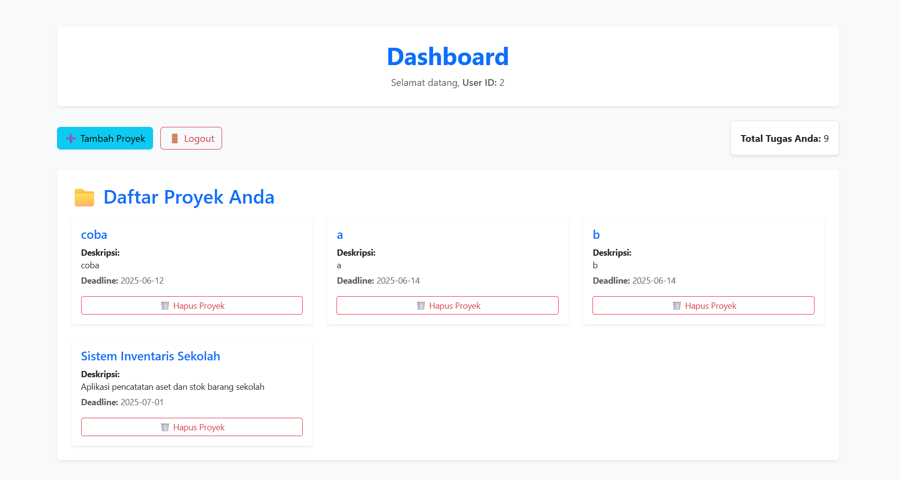
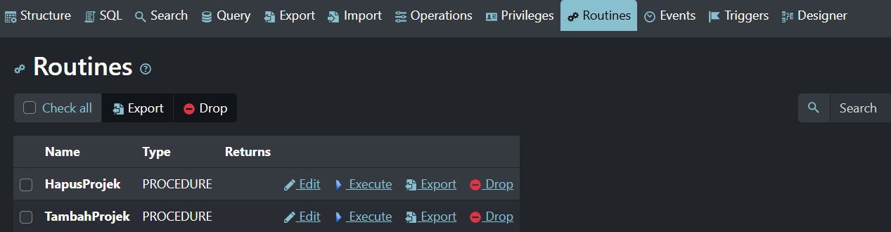
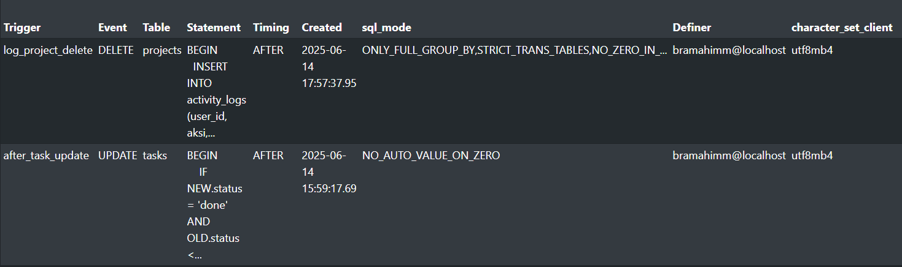
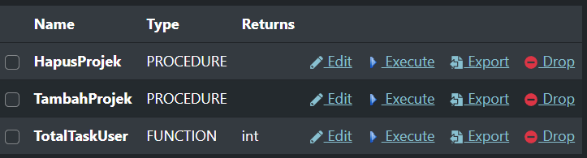
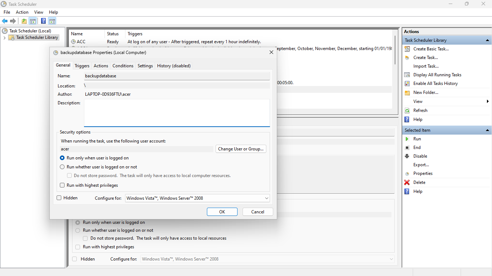
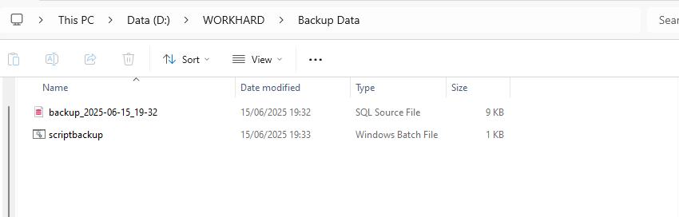

# Workdiff (Proyek PDT😅)
Repository ini berisi sistem manajemen proyek berbasis PHP dan MySQL yang dirancang untuk mengelola proyek secara efisien. Sistem ini memanfaatkan stored procedure, trigger, transaction, dan stored function untuk memastikan integritas data dan keamanan transaksi.



## 📌 Detail Konsep

### ⚠️ Disclaimer

Penerapan stored procedure, trigger, transaction, dan stored function dalam proyek ini disesuaikan dengan kebutuhan workdif. Implementasi dapat berbeda tergantung pada arsitektur dan kebutuhan sistem lainnya.

### 🧠 Stored Procedure 
Stored procedure digunakan untuk menangani operasi penting dalam sistem manajemen proyek, seperti pembuatan proyek, penghapusan proyek, dan pencatatan aktivitas.



Beberapa procedure penting yang digunakan:

`views/tambah_project.php`
* `TambahProjek(p_nama_projek, p_deskripsi, p_user_id, p_deadline)`: Menambah projek baru
  ```php
  try {
        $stmt = $pdo->prepare("CALL TambahProjek(?, ?, ?, ?)");
        $stmt->execute([$nama, $deskripsi, $user_id, $deadline]);

        header("Location: index.php?route=dashboard&success=project_added");
        exit;
    } catch (PDOException $e) {
        error_log("Error adding project: " . $e->getMessage());

        header("Location: index.php?route=tambah_project&error=db_error&msg=" . urlencode($e->getMessage()));
        exit;
    }
  ```
* `HapusProjek(p_project_id, p_user_id)`: Menghapus projek ketika klik button hapus
  ```php
  try {
        $stmt = $pdo->prepare("CALL HapusProjek(?, ?)");
        $stmt->execute([$projectId, $userId]);

        header("Location: index.php?route=dashboard&success=project_deleted");
        exit;
    } catch (PDOException $e) {
        $errorMessage = $e->getMessage();
        error_log("Error deleting project: " . $errorMessage);

        header("Location: index.php?route=dashboard&error=db_error&msg=" . urlencode($errorMessage));
        exit;
    }
  ```


### 🚨 Trigger
Trigger `validate_transaction` berfungsi sebagai sistem pengaman otomatis yang aktif sebelum data masuk ke dalam tabel. Seperti palang pintu yang hanya terbuka jika syarat tertentu terpenuhi, trigger mencegah input data yang tidak valid atau berisiko merusak integritas sistem.



Trigger `validate_transaction` otomatis aktif pada procedure berikut:
* `log_project_delete`
  ```sql
  INSERT INTO activity_logs (user_id, aksi, waktu)
  VALUES (
    IFNULL(OLD.user_id, 0),
    CONCAT('Menghapus proyek "', IFNULL(OLD.nama_projek, 'Tidak diketahui'), '" (ID: ', OLD.id, ')'),
    NOW()
  );
  ```
* `after_task_update`
  ```sql
  INSERT INTO activity_logs(user_id, aksi)
    VALUES (NEW.assigned_to, CONCAT('Menyelesaikan task "', NEW.judul, '"'));
  ```

Beberapa peran trigger di sistem ini:
* Mencatat ke dalam activity_log jika projek dihapus
* Mencatat ke dalam activity_log jika status task diubah menjadi "done"

Dengan adanya trigger di lapisan database, validasi tetap dijalankan secara otomatis, bahkan jika ada celah atau kelalaian dari sisi aplikasi. Ini selaras dengan prinsip reliabilitas pada sistem terdistribusi.

### 🔄 Transaction (Transaksi)
Transaksi digunakan untuk memastikan bahwa operasi yang melibatkan beberapa tabel tetap konsisten. Misalnya, saat menghapus task, sistem akan menghapus data terkait dan mencatat log dalam satu transaksi.

`views\tambah_task.php`
* Implementasi transaction untuk procedure `task_baru`
  ```php
  try {
        $pdo->beginTransaction(); // Mulai transaksi untuk operasi atomik

        $stmt1 = $pdo->prepare("INSERT INTO tasks (project_id, judul, deskripsi, assigned_to, status, deadline) VALUES (?, ?, ?, ?, ?, ?)");
        $stmt1->execute([$project_id, $judul, $deskripsi, $assigned_to, $status, $deadline]);

        $stmt2 = $pdo->prepare("INSERT INTO activity_logs (user_id, aksi) VALUES (?, ?)");
        $aksi = 'Menambahkan task "' . $judul . '" untuk proyek ID ' . $project_id;
        $stmt2->execute([$_SESSION['user_id'], $aksi]); // Log user yang membuat task

        $pdo->commit(); // Commit transaksi jika semua berhasil

        // PENTING: Redirect kembali ke halaman tugas proyek yang relevan melalui router
        header("Location: index.php?route=project_tasks&project_id=" . htmlspecialchars($project_id) . "&success=task_added");
        exit;
    } catch (Exception $e) {
        $pdo->rollBack(); // Rollback transaksi jika ada error
        error_log("Gagal menambahkan task: " . $e->getMessage());
        // PENTING: Redirect ke rute tambah_task dengan pesan error database
        header("Location: index.php?route=tambah_task&project_id=" . htmlspecialchars($project_id) . "&error=db_error&msg=" . urlencode($e->getMessage()));
        exit;
    }

  ```
Metode transaction diatas adalah untuk memastikan task dan log aktivitas tercatat bersamaan karena jika salah satu gagal, dibatalkan semua


### 📺 Stored Function 
Stored function digunakan untuk mengambil informasi tanpa mengubah data. Misalnya, function get_project_count(p_owner_id) mengembalikan jumlah proyek yang dimiliki oleh pengguna.

Contohnya, function  `TotalTaskUser(p_user_id)` mengembalikan total task yang dimiliki oleh pengguna dengan user_id tertentu.

Function ini digunakan langsung dalam sebuah file secara langsung di file task.php. Fungsi dari function ini adalah untuk menampilkan jumlah task yang dimiki dalam halaman website dalam satu waktu. Berikut ini adalah dokumentasi dari function




### 🔄 Backup Otomatis
Untuk menjaga ketersediaan dan keamanan data, sistem dilengkapi fitur backup otomatis menggunakan `mysqldump`dan task scheduler. Backup dilakukan secara berkala dan disimpan dengan nama file yang mencakup timestamp, sehingga mudah ditelusuri. Semua file disimpan di direktori `storage/backups`.




`srcriptbackup`
  @echo off
  setlocal enabledelayedexpansion

  :: LOG AWAL
  echo [%date% %time%] Menjalankan backup_debug.bat >> "D:\WORKHARD\Backup Data\debug_task.txt"

  :: KONFIGURASI
  set "backupDir=D:\WORKHARD\Backup Data"
  set "mysqlBinDir=D:\APK\Laragon\laragon\bin\mysql\mysql-8.0.30-winx64\bin"
  set "database=manajemen_pekerjaan"
  set "user=root"
  set "password="

  :: TIMESTAMP
  set "year=%date:~6,4%"
  set "month=%date:~3,2%"
  set "day=%date:~0,2%"
  set "hour=%time:~0,2%"
  set "minute=%time:~3,2%"
  if "%hour:~0,1%"==" " set "hour=0%hour:~1,1%"
  set "timestamp=%year%-%month%-%day%_%hour%-%minute%"

  :: CEK FOLDER BACKUP
  if not exist "%backupDir%" (
      mkdir "%backupDir%"
      echo [%date% %time%] Membuat folder backup >> "%backupDir%\debug_task.txt"
  )

  :: JALANKAN BACKUP
  "%mysqlBinDir%\mysqldump.exe" -u %user% %database% --result-file="%backupDir%\backup_%timestamp%.sql" > "%backupDir%\debug_output.log" 2>&1


  endlocal

## 🧩 Relevansi Proyek dengan Pemrosesan Data Terdistribusi
Sistem ini dirancang dengan memperhatikan prinsip-prinsip dasar pemrosesan data terdistribusi:
* **Konsistensi**: Semua transaksi dieksekusi dengan procedure dan validasi terpusat di database.
* **Reliabilitas**: Trigger dan transaction memastikan sistem tetap aman meskipun ada error atau interupsi.
* **Integritas**: Dengan logika disimpan di dalam database, sistem tetap valid walaupun dipanggil dari banyak sumber (web, API, dsb).